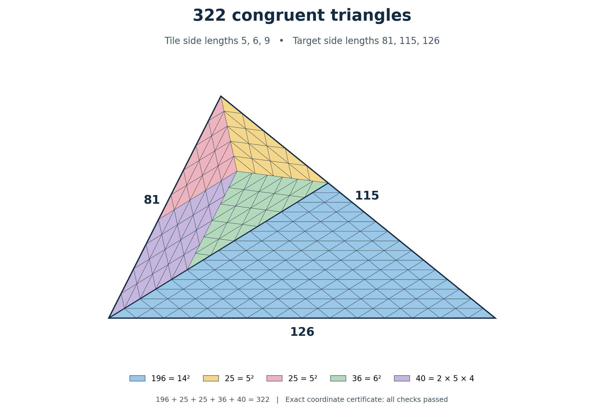

# Erdős Problem 634 — prime-case candidate and exact triangle tilings

[](STATUS.md)
[](REPRODUCIBILITY.md)
[](CHANGELOG.md)

**Denis Paliy · 29 September 2026**

[Русское описание](README.ru.md) · [Claim ledger](STATUS.md) · [Reproduce](REPRODUCIBILITY.md) · [Citation](CITATION.cff)

This repository presents a candidate classification of **all prime tile counts**, an eventual construction theorem for **all five rational target shapes in the $3\alpha+2\beta=\pi$ family**, and a complete classification for the fixed tile **$(2,3,4)$**. It also supplies an explicit **322-tile construction** and a separately replayed global exclusion of **21**. The full classification requested in [Erdős problem 634](https://www.erdosproblems.com/634) remains unresolved in this work.

Latest geometric continuation: a [six-corner certificate](docs/n105-six-corner-obstruction.md) excludes a third fixed N=105 collar, and a [boundary argument](docs/f1-two-longest-edges.md) forces exactly two edges of each length on the short side of the remaining (8,7,13) F1 target. Neither result decides 105 globally.

## Main candidate: all prime counts

The proposed theorem is: for a prime $p$, some triangle can be tiled by $p$ congruent triangles if and only if

$$
p=2,\qquad p=3,\qquad\text{or}\qquad p\equiv1\pmod4.
$$

The new geometric arguments concern two target shapes for tiles satisfying $3\alpha+2\beta=\pi$:

- the scalene shape $W=(2\alpha,\beta,\alpha+\beta)$;
- the isosceles shape $(\beta,3\alpha,\beta)$.

For primitive tile sides $(uv,v^2-u^2,v^2)$, the proposed proof excludes both scale-one targets. In the isosceles case, a forced triangular patch leaves a scale-one $W$ triangle; a separate boundary induction excludes that remainder. Combining these obstructions with the stated classification results would establish the prime-count theorem. Reflections and T-junctions are allowed.

**This is a candidate proof requiring external mathematical scrutiny.** Its forced-patch and column-completion steps have undergone internal checks, but finite certificate replay does not certify the universal geometric arguments.

Start with the [complete prime-case candidate manuscript](paper/prime-case-candidate.pdf). It includes the two new geometric arguments, the exhaustive classification table, the other branch calculations and explicit existence constructions. The [geometric working text](docs/prime-case-candidate.md) and [dependency note](docs/prime-case-dependencies.md) provide additional review material.

## A complete construction family

For the fixed primitive tile

$$
(a,b,c)=(uv,v^2-u^2,v^2),\qquad 0<u<v,\quad\gcd(u,v)=1,
$$

with corresponding angles $\alpha,\beta,\gamma$, the target shape $(2\alpha,\alpha,2\beta)$ admits exactly the counts

$$
\boxed{N=k^2(2v^2-u^2)(3v^2-u^2),\qquad k\ge1.}
$$

The proof joins Beeson's existing $c(b+c)$-tile construction to a standard $(b+c)^2$-tile triangular block. Necessity follows from the primitive integer side proportions. This argument is independent of the proposed scale-one nonexistence proofs.

For $(u,v)=(2,3)$, the tile has sides $(6,5,9)$ and the construction gives

$$
\underbrace{(84,45,81)}_{126\text{ tiles}}
\quad+_{\,84}\quad
\underbrace{(84,70,126)}_{196\text{ tiles}}
\quad\longrightarrow\quad
\underbrace{(81,115,126)}_{322\text{ tiles}}.
$$

The two triangles meet along their common side of length $84$. At one end, the angles sum to $\pi$, so the union is a triangle. The corresponding minimal count is listed as undecided after Theorem 14 of [Beeson's version 4](https://arxiv.org/abs/1206.2229v4). This repository makes no priority claim.



[Two-page proof and diagram](paper/two-piece-construction.pdf) · [Full coordinate argument](docs/two-piece-construction.md) · [Exact certificate](data/tiling-322.json) · [Vector figure](figures/tiling-322.svg)

## What the computations establish

A separately implemented exact-arithmetic checker reads the 322-tile coordinate certificate without importing the construction program. The retained internal check establishes:

| Check | Result |
|---|---:|
| Congruent tiles with sides $5,6,9$ | 322 |
| Outer triangle sides | $81,115,126$ |
| Tile-pair intersections checked | 51,681 |
| Positive-area overlaps | 0 |
| Interior atomic edges, each canceled in opposite directions | 474 |
| Outer boundary atomic edges | 42 |
| Distinct T-junction vertices | 24 |

Containment, disjoint interiors and equality of total area establish coverage. Every geometric calculation uses exact arithmetic. The finite checks validate the coordinate construction; the all-parameter theorem follows from its mathematical proof.

Both implementations belong to this research project. Their independence is computational, not external peer review.

## Reproduce

Python 3.10 or later; the certificate checks use only the standard library. From the repository root:

```bash
python3 scripts/reproduce.py
```

Generate and check the $(u,v)=(2,3)$ construction separately:

```bash
python3 scripts/generate_tiling.py 2 3 output.json
```

Use normal Python execution, without `-O` or `-OO`. See [REPRODUCIBILITY.md](REPRODUCIBILITY.md) for the verification boundary. Replaying certificates is not a computational proof of the all-primes candidate.

## Further progress and the remaining frontier

| Result | Scope |
|---|---|
| [All five rational shapes, for every primitive tile](docs/universal-rational-scales.md) | Two exact annular dissections add the coprime increments $u$ and $v$. Every sufficiently large admissible scale is realizable, with **no restriction on the sign of $\Delta$**. All five bounds are explicit in the tile parameters; the [seed appendix](docs/explicit-theta-seeds.md) covers both signs of $\Delta$. Small scales remain unclassified in general. |
| [Complete classification for tile $(2,3,4)$](docs/first-tile-classification.md) | All triangular targets are covered: square counts; $7t^2,11t^2,21t^2$ for $t\ge2$; $3t^2$ for $t\ge4$; and $77t^2$ for $t\ge1$. Known W/beta spectra are credited to Bonfioli. |
| [Global exclusion of 21](docs/n21-global-reduction.md) | Every classified branch reduces to one instance, excluded by a 391-state certificate with a separate exact replay. This independently reproduces an exclusion previously reported by Bonfioli and Harries; no priority claim. |
| [The remaining $N=105$ cases](docs/open-frontier.md#the-remaining-n105-investigation) | Exact partial boundary collars for tiles $(5,21,19)$ and $(7,15,13)$ cover the outer boundary. A [four-placement obstruction](docs/n105-fixed-collar-obstructions.md) proves that these two fixed collars cannot extend. Other collars and the global count 105 remain unresolved. |

The 75-, 147- and 243-tile theta constructions passed separate exact intersection and boundary checks. The smallest example also contradicts the stated integrality conclusion of Lemma 55 in Beeson v4: its scale parameter is $\mu=15/2$ and coloring number is $M=5$. The prime-case candidate does not use that lemma. See the [theta note](docs/theta-branch.md) for the source comparison and the [open frontier](docs/open-frontier.md) for the remaining general composite-count problem.

The count 75 was already globally admissible. The new construction specifically tiles $(30,30,15)$ by 75 copies of $(2,3,4)$ and completes this fixed-tile spectrum.

## Reading guide

| Purpose | Start here |
|---|---|
| Assess the proposed result for all primes | [Complete candidate manuscript](paper/prime-case-candidate.pdf) and [dependency note](docs/prime-case-dependencies.md) |
| Read the universal coprime-increment construction | [Two annuli and the eventual theorem](docs/universal-rational-scales.md) |
| Read the complete fixed-tile answer | [All targets for $(2,3,4)$](docs/first-tile-classification.md) |
| Check the elementary construction | [Two-page construction note](paper/two-piece-construction.pdf) |
| Reproduce the exact finite evidence | [Reproducibility](REPRODUCIBILITY.md) |
| Find the remaining mathematical work | [Open frontier](docs/open-frontier.md) |
| Distinguish claims and validation levels | [Status ledger](STATUS.md) |

The editable LaTeX sources accompany both PDFs in [`paper/`](paper/). Exact certificates are in [`data/`](data/) and checking programs in [`scripts/`](scripts/).

## Authorship and assistance

Denis Paliy set the research direction and guided the investigation. ChatGPT assisted with proof exploration, drafting, programming and verification. The supplied arguments and inspectable computations support the claims. See [AI_USAGE_DISCLOSURE.md](AI_USAGE_DISCLOSURE.md).

No external referee acceptance, formal proof-assistant verification, full solution of problem 634 or adjudicated priority is claimed. Corrections and independent checks are welcome; see [CONTRIBUTING.md](CONTRIBUTING.md).

## Citation and reuse

Use [CITATION.cff](CITATION.cff), recording the version or commit examined. Original software is licensed under [MIT](LICENSE); original manuscripts, figures and documentation under [CC BY 4.0](LICENSE-DOCUMENTATION.md). Third-party works are cited and retain their own rights. Historical third-party code with unresolved redistribution terms is not included.
