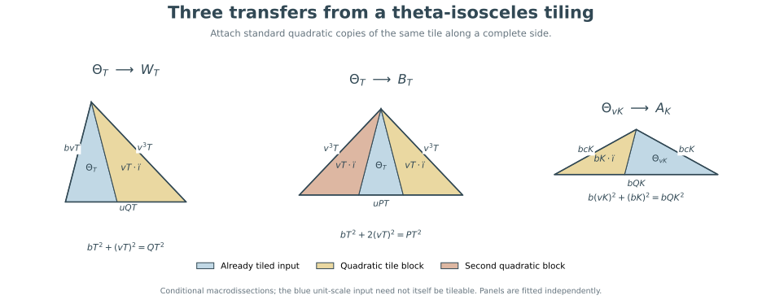

# Two parity constraints and an eventual spectrum for all five rational shapes

29 September 2026. Research note by Denis Paliy. The argument has received
internal mathematical checks; external review and priority are not established.
This does not solve Erdős problem 634 in full.

## 1. The common parameters

Let

$$
a=uv,\qquad b=v^2-u^2,\qquad c=v^2,\qquad 0<u<v,\quad \gcd(u,v)=1,
$$

$$
Q=b+c=2v^2-u^2,\qquad P=b+2c=3v^2-u^2.
$$

The tile angles opposite a,b,c are alpha,beta,gamma and satisfy
`3alpha+2beta=pi`. Write `theta=alpha+beta`.

The elementary deductions below sharpen the scale arithmetic in the two
isosceles shapes. They use the two directed-edge characters introduced in
Beeson's version 4, Lemmas 18–23 and Theorems 3–4, reproduced here to make
the needed parity argument explicit. They do not use the incorrect
divisibility statement of his Lemma 55.

**Arithmetic theorem.** If the target is theta-isosceles (apex alpha), then

$$
N=bT^2,\qquad X=bvT,\qquad Y=ubT,\qquad T\in\mathbb Z_{>0}.
$$

Here $X$ is an equal side and $Y$ is the base.

If the target is alpha-isosceles (base angles alpha), then

$$
N=bQK^2,\qquad X=bcK,\qquad Y=bQK,\qquad K\in\mathbb Z_{>0}.
$$

These are necessary conditions for every primitive tile, including when b
has square factors. They are not unconditional existence statements.

**Eventual existence theorem in the Beeson range.** Put

$$
\Delta=b(a^2+b^2)-a^2c=b^3-cu^4,\qquad F=(a-1)(b-1),
$$

$$
B=\left\lceil\frac{(a^2c+F)(a^2+b^2)}{u\Delta}\right\rceil.
$$

Suppose Delta>0. Then all of the following tilings exist:

| Target shape | Count | Scales supplied |
|---|---|---|
| W: `(2alpha,beta,theta)` | `Q T²` | every integer `T>=B` |
| beta-isosceles | `P T²` | every integer `T>=B` |
| theta-isosceles | `b T²` | every integer `T>=B` |
| alpha-isosceles | `bQ K²` | every integer `K>=ceil(B/v)` |
| other scalene `(2alpha,alpha,2beta)` | `QP K²` | every integer `K>=1` |

For the first four rows the displayed count forms are also necessary.
Thus only finitely many scales per fixed tile remain below the indicated
explicit bounds in this parameter range. The earlier eventual-gcd
divisors of the W and beta spectra are therefore **d=1 whenever Delta>0**.

The other-scalene row is the complete two-piece construction proved in
[the two-piece construction](two-piece-construction.md); the new deductions here are the sharper
theta/alpha arithmetic and the propagation of the theta construction.

## 2. Two genuine signed-direction characters

Put delta=theta. The angle identities are

    alpha=pi-2delta, beta=3delta-pi, gamma=pi-delta,
    pi/3<delta<pi/2, 2cos(delta)=u/v.

The ratio delta/pi is irrational: otherwise 2cos(delta) would be a
rational algebraic integer, hence an integer, whereas 0<u/v<1.

After fixing one directed edge as direction zero, every directed edge in
the tiling has a unique direction label

    n delta + epsilon pi,   n in Z, epsilon in Z/2Z.

To see propagation, the counterclockwise exterior turns of a tile are
delta,2delta and -3delta modulo 2pi. Reflections reverse the sequence.
Across a nonempty shared edge segment the orientation reverses, adding
pi. The adjacency graph through shared edge segments is connected for a
finite dissection of a triangle. Uniqueness follows from irrationality.

Define

    chi1(n,epsilon)=(-1)^epsilon,
    chi2(n,epsilon)=(-1)^(n+epsilon).

Both change sign when an edge is reversed. They are functions of the
actual direction group; no character from the unrelated 120-degree case
is being substituted here.

Traverse each tile counterclockwise. Starting with its a-edge, the three
edge lengths a,b,c occur at direction indices n,n+1,n+3 with a common
epsilon, or n,n-1,n-3 for the reflected orientation. Therefore the tile's
length-weighted directed-edge sums are respectively

    plus or minus (a+b+c),     plus or minus (a-b-c).

The two signs can differ, but each is a sign, not a complex phase. Summing
over N tiles gives integer signed tile counts M1,M2 with

    M1 congruent M2 congruent N (mod 2).

Interior edges cancel after grouping lengths on each maximal collinear
interface, since both characters reverse sign. This cancellation permits
arbitrary T-junctions: only additivity of length on a straight segment is
used. The two surviving sums are those of the target boundary.

## 3. Theta-isosceles: all square factors of b are compulsory

The theta-isosceles target has primitive side proportions `(v,v,u)`.
Every outer side is an integer sum of complete tile edges; hence its
actual sides are `(vL,vL,uL)` for a positive integer L, by Bezout and
gcd(u,v)=1.

List its corner angles as `(delta,alpha,delta)` and normalize its first
directed leg to index (0,0). The next leg has direction 2delta and the
base has direction delta+pi. Thus its boundary character values are

    Phi1=2X-Y=L(2v-u),
    Phi2=2X+Y=L(2v+u).

The tile factors satisfy

    a+b+c=(v+u)(2v-u),
    a-b-c=-(v-u)(2v+u).

Consequently

    M1=L/(v+u),     M2=-L/(v-u).

Since M1,M2 have the same parity, both half-sum and half-difference are
integers. Directly,

    (M1+M2)/2 = -uL/b,
    (M1-M2)/2 =  vL/b.

Hence b divides uL and vL. Bezout gives b|L. Write L=bT. Comparing the
target area `X² sin(alpha)/2` with the tile area `bc sin(alpha)/2` gives

    N=X²/(bc)=L²/b=bT².

This gives the claimed target dimensions. In the earlier area-only
notation `b=q h²`, `N=q t²`, this proves `h|t`, so t=hT. No squarefree-b
assumption is needed.

In particular the mixed-strip construction for all large `bT²` already
covers all possible arithmetic scales in its geometric parameter range;
there is no additional nonsquarefree-b family to handle there.

## 4. Alpha-isosceles: exact necessary count form

The alpha-isosceles target has equal sides cL and base QL, because
`sin(2alpha)/sin(alpha)=Q/c`. The pair c,Q is coprime, so integer boundary
lengths force L to be a positive integer.

Normalize the first directed equal side to zero. The directions of the
other equal side and base have indices -4 and -2, with epsilon=0. Thus
both target character sums equal its perimeter:

    Phi1=Phi2=L(2c+Q)=L(2v-u)(2v+u).

Dividing by the same tile factors as above gives

    M1=L(2v+u)/(v+u),
    M2=-L(2v-u)/(v-u).

Their half-difference is

    (M1-M2)/2=LQ/b.

It is an integer. Since gcd(Q,b)=gcd(c,b)=1, b divides L. Put L=bK.
The included target angle at the apex is pi-2alpha. Using
`sin(2alpha)/sin(alpha)=Q/c`, its area ratio is

    N = (cL)² sin(2alpha)/(bc sin(alpha))
      = Q L²/b = bQ K².

This supplies the exact necessary form in the second isosceles branch.
It also gives an immediate composite-count restriction there, because
b>1 and Q>1.

## 5. Theta existence for every large admissible scale when Delta>0

The following is the mixed-strip version of the macrogeometry in
Beeson's Theorem 24, established in [the theta-branch note](theta-branch.md), Section 7.
Its parameters and positive-length checks are included for clarity.

For integer T>=B, choose an integer J in

    uT/(a²+b²) <= J <= (ubT-F)/(a²c).

The length of this interval is

    [uT Delta - F(a²+b²)]/[a²c(a²+b²)],

which is at least 1 by the definition of B. The target has
`mu=bT/v`, equal side `mu c=bvT`, and base `mu a=ubT`.

The five similar triangular pieces in Theorem 24 have integer scales

    a²J, abJ, a u²J, vT-acJ, uT-a²J.

The interval's upper bound ensures the last two are positive. The first
parallelogram has side lengths

    L=ubT-a²cJ >= F,      H=ab u²J.

Since gcd(a,b)=1, the Frobenius bound gives `L=xa+yb` with nonnegative
integers x,y. The other length H is a multiple of both a and b. Split
the L-direction into a-strips and b-strips. Use b-steps along H in an
a-strip, and a-steps in a b-strip. Each a-by-b cell has included angle
gamma and splits along its difference diagonal into two copies of the
tile. This avoids requiring the auxiliary scale r in Theorem 24 to be
an integer.

The final parallelogram has side lengths

    b(uT-a²J),      a[(a²+b²)J-uT].

These are nonnegative multiples of b and a respectively, so it has an
ordinary grid tiling; a zero-width final parallelogram is simply absent.
All shared-boundary identities are exactly those of Theorem 24. The
pieces therefore fill the theta target, whose area is bT² tile areas.

The construction is uniform in u,v and T. Section 3 now shows that the
formula bT² covers every arithmetic possibility, even if b is not
squarefree.

## 6. Three elementary gluing transfers

These transfers use only whole already tiled pieces and standard
quadratic copies of the same tile. They assert no forced decomposition
of an arbitrary tiling.

### Theta_T to W_T

Take the theta triangle with vertices A,B,C, angles `(theta,alpha,theta)`,
equal legs `AB=BC=bvT`, and base `AC=ubT`. Glue a `vT`-fold copy of the
tile along BC, using its b-side. Match its alpha corner to B and gamma
corner to C. At C the angles gamma+theta sum to pi, so C disappears from
the outer boundary. At B the angle becomes 2alpha; the other two angles
are theta and beta. The resulting sides are

    bvT, v³T, ubT+uv²T=uQT.

This is W_T. The counts add as `bT²+cT²=QT²`.

### W_T to beta_T

Attach a second `vT`-fold copy along the side bvT, matching the tile's
alpha to the 2alpha corner and gamma to the theta corner. The latter
becomes straight and the former becomes 3alpha. The other two corners
are beta, producing beta_T with equal sides v³T and base uPT.
The count is `QT²+cT²=PT²`.

### Theta_(vK) to alpha_K

The theta triangle at scale vK has equal legs bcK and base abK. Attach
a `bK`-fold tile along its a-side, of length abK, to the theta base.
Match its gamma corner to one theta corner and beta to the other. The
first pair becomes straight; the second becomes alpha+2beta. The two
remaining corners are alpha. The new triangle has equal sides bcK and
base `bcK+b²K=bQK`. The counts are

    b(vK)²+(bK)²=bQK².

Therefore the theta threshold B gives W and beta at every T>=B, and
alpha at every K>=ceil(B/v), as asserted in Section 1.

### Exact coordinates for the transfers

Coordinates `(x,y)` in this paragraph represent physical points
`(x,y sqrt(D))`, where `D=4v²-u²`. For the first two transfers use

    A=(0,0), C=(ubT,0), B=(ubT/2,bT/2),
    Dpoint=(uQT,0), E=(-ucT,0).

The theta input is ABC, the first added tile-shaped block is BCDpoint,
and the second is EAB. Their outer unions are ABDpoint (W) and
EBDpoint (beta). The common base line orders E,A,C,Dpoint, and B lies
strictly above it; containment and disjoint interiors follow directly.
The two added triangles each have sides `(vT)(a,b,c)`.

For the third transfer take

    A=(0,0), C=(abK,0), B=(abK/2,bvK/2), E=-(b/c)B.

The input theta triangle is ABC, the tile-shaped block is ACE, and the
outer alpha-isosceles triangle is BCE. The points E,A,B are collinear
in that order, and C lies on one side of their line. The attached block
has sides `(bK)(a,b,c)`. These coordinate descriptions specify the
gluings without relying on a printed diagram.

## 7. Exact checks of the uniform construction

`scripts/check_eventual_families.py` reconstructs the seven macroregions of
the theta construction in rational coordinates. For each triangular
block it checks the three squared side lengths against the claimed
integer multiple of the tile. For the two parallelograms it checks
their side lengths, integral grid counts, and the mixed-strip
decomposition. It checks containment, area, and every one of the 21
macroregion pairs for disjoint interiors. It does not enumerate all
individual tiles in these potentially very large tilings.

The named cases include genuine nonsquarefree values of b:

| `(u,v)` | Tile | `b` | Threshold and checked scale | Count |
|---|---|---:|---:|---:|
| `(1,2)` | `(2,3,4)` | 3 | 11 | 363 |
| `(1,3)` | `(3,8,9)` | 8 | 14 | 1,568 |
| `(3,5)` | `(15,16,25)` | 16 | 452 | 3,268,864 |

All 132 coprime pairs with `v<=25` and Delta>0 passed the same exact
macroregion checks at their stated threshold. The three gluing
transfers were independently checked on all 199 coprime pairs with
`v<=25`, including the range Delta<0 where the transfers still work.
Results are recorded in `verification/eventual-family-checks.json`.

The finite checks validate the formulas and implementation; the uniform
proof is Sections 2–6. A separate internal mathematical reviewer also
reconstructed the two characters, both arithmetic deductions, all
three transfers, and the interval/strip construction, finding no gap.
This is not external refereeing or proof-assistant verification.

## 8. Relation to the full problem

For each fixed primitive tile satisfying Delta>0, every sufficiently
large scale in all five classified rational target shapes is now
constructed, with explicit bounds and matching necessary count forms.
This is a cofinite result per tile, not a classification of every N.

The missing parts include the finite ranges below these bounds; the
complementary range Delta<0, where Laczkovich's different geometry gives
some tiling but not yet a construction at every sufficiently large
admissible scale; and the separate 60-degree/120-degree families.
The uniform finite-exception problem across unbounded u,v is also not
settled. The full Erdős problem must not be called solved.

Primary source: Michael Beeson, *Triangle Tiling: The Case
3alpha+2beta=pi*, [arXiv:1206.2229v4](https://arxiv.org/abs/1206.2229v4), Sections 7–8 and Theorem 24.
The two characters and their parity are his inputs. The short divisibility
deductions and propagation here are derived from them; priority of those
deductions has not been checked.

Independent internal audit: [eventual rational families](audits/eventual-rational-families.md).
