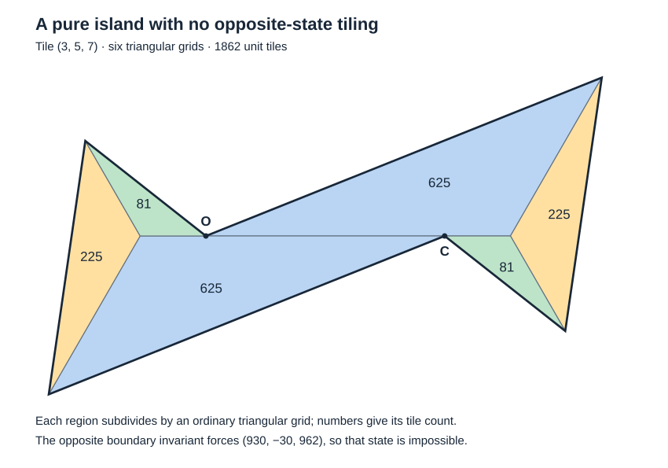

# A pure nonconvex island that cannot change chirality

6 October 2026. Denis Paliy, research with ChatGPT assistance.

**Universal nonconvex pure-island exchange is false.** We give an actual
simple polygonal disk, tiled by 1862 copies of the triangle with sides
$(3,5,7)$ in one pure state, which has no tiling in the opposite pure
state. This closes the general exchange conjecture negatively, including
the fully matched lattice-disk subclass of the
[phase reduction](nonconvex-pure-island-reduction.md). It does not solve
Erdős problem 634, which concerns triangular targets and all tile counts.

The [triangular embedding continuation](extreme-pure-island-in-triangle.md)
places a scaled copy as the unique extreme pure component of an actual
equilateral tiling. Restriction to triangular targets does not restore
the proposed opposite-pure exchange. This still leaves mixed and global
normalization open.

The construction and obstruction were checked in separate internal
mathematical passes. An exact coordinate certificate is provided below.
No external review, formal proof-assistant verification, or priority is
claimed.

## 1. Statement and conventions

Let $a,b$ be positive integers with $b>a$ and put
$$
D=a^2+ab+b^2.
$$
The construction uses the 120-degree triangle with sides $a,b,\sqrt D$.
For the application here, require $D=c^2$ and $\gcd(a,b,c)=1$.
Write planar coordinates in the basis $1,\rho$, where
$\rho=e^{i\pi/3}$, and set
$$
R=\operatorname{conv}\{(0,0),(a+b,-b),(a,0)\}.
$$
A pure state consists of translations of the six rotations $\rho^jR$.
The opposite state is its reflected family, rotated so that the three
long-edge directions agree with those of the first state. Put
$$
u=(a+b,-b),\qquad w=(b,a)=\rho u,\qquad v=(-a,a+b)=w-u.
$$

**Theorem.** If $b^2>a^2+ab$, there is a simple, centrally symmetric,
nonconvex polygon whose boundary has only long-edge directions, which
admits a pure tiling by
$$
N=2(a^4+a^2b^2+b^4)=2D(a^2-ab+b^2)
\tag{1}
$$
unit tiles and admits no opposite-state pure tiling. The impossible
opposite tiling may have arbitrary translations and T-junctions;
no matching or lattice assumption is imposed on it.

The primitive integral example $(a,b,c)=(3,5,7)$ satisfies the inequality.
Its polygon, in cyclic order, is
$$
(0,0),\ (125,75),\ (170,-45),\ (98,0),\ (-27,-75),\ (-72,45).
\tag{2}
$$

## 2. An actual positive tiling

Use lifted coordinates and projection
$$
\pi(L_0,L_1,L_2)=(L_2-L_1,L_1-L_0).
$$
The long vectors have lifts
$$
U=(0,-b,a),\quad V=(-a,0,b),\quad W=(-b,a,0),
\qquad \pi U=u,\ \pi V=w,\ \pi W=v.
$$
Let $K=b^3-a^3>0$ and take
$$
\begin{aligned}
O&=(0,0,0), & A&=(-ab^2,0,b^3),\\
B&=(0,-a^2b,b^3), & C&=(0,0,K), & F&=(0,0,b^3).
\end{aligned}
$$
The three oriented triangles $OAF,ABF,BCF$ are in coordinate planes.
Their doubled vector areas are respectively
$$
(0,ab^5,0),\qquad (0,0,a^3b^3),\qquad (a^5b,0,0).
\tag{3}
$$
Their projections are genuine copies of allowed pure triangles, at
scales $b^2,ab,a^2$, respectively. Here is an explicit orientation check:
the corresponding unit prototypes are
$$
\{0,V,be_2\},\quad \{0,-be_0,-ae_1\},\quad
\{0,-be_1,-ae_2\}.
$$
After projection they are, respectively,
$\rho^4R+(b,a)$, $\rho^2R+(a,-a)$, and $R-(a,0)$.
Subdivide an integer-scaled triangle of scale $s$ by the ordinary
triangular grid into $s^2$ unit triangles. This uses only translations
and half-turns of its prototype, so all tiles remain in the same pure
state. No further dilation is required.

We now prove that these are positive pieces of a polygon, rather than
a signed chain. Their planar vertices are
$$
O=(0,0),\quad A=(b^3,ab^2),\quad
B=(b^3+a^2b,-a^2b),\quad C=(K,0),\quad F=(b^3,0).
$$
Triangle $OAF$ lies above the axis with $x\le b^3$, and $ABF$ lies
in $x\ge b^3$; they meet along $AF$. Triangle $BCF$ lies below the
axis; it meets $OAF$ along $CF\subset OF$. Finally $ABF$ and $BCF$
are on opposite sides of their common edge $BF$. Thus their interiors
are disjoint, and their union is the simple quadrilateral
$Q=OABC$, with reflex corner $C$.

Adjoin its half-turn $Q'=C-Q$. The original cap lies in $x\ge0$;
its half-turn lies in $x\le K$. In their only possible common range
$0\le x\le K$, the original lies above the axis and the half-turn
below it. Hence
$$
Q\cap Q'=[O,C].
$$
The union is a simple polygonal disk with boundary
$O,A,B,C,C-A,C-B$. Its six edge vectors are
$$
b^2w,\ -abv,\ -a^2u,\ -b^2w,\ abv,\ a^2u.
\tag{4}
$$
Every external side therefore consists of whole long edges. The only
short cap boundary disappears along the glued segment $OC$.
Different grid spacings at short seams give permissible T-junctions.

Group unit tiles by the coordinate plane of their lift, in order
$L_0,L_1,L_2$ constant. The actual population vector is
$$
\boxed{n=2(a^4,b^4,a^2b^2).}
\tag{5}
$$
This proves (1) and constructs every unit tile. All projected coordinates
are integral. In the primitive integral case, $u,w,v$ are primitive
short-lattice vectors; consequently any positive internal long contact
is whole-to-whole. Thus the counterexample belongs to the reduced
single-phase matched-disk subclass as well.

## 3. A boundary invariant for every hypothetical opposite tiling

For a pure tiling of a disk, assign to each short-edge segment its
signed coordinate-axis lift and to each long-edge segment the
corresponding signed multiple of $U,V,W$. These assignments agree on
overlapping segments. Short and long direction classes are distinct.
Each tile has zero lifted boundary sum. Atomize the T-junctions to make
a finite cell complex; since the region is a disk, these closed edge
increments integrate to a single-valued lift, unique up to translation.
Extend affinely over the tiles. This argument does not require a common
lattice or whole-edge matching.

Orient the lift so that each tile has positive coordinate-axis normal;
all these orientations project with the same sign. For a lifted boundary
$\Gamma$, its vector area is
$$
p=\frac12\int_\Gamma L\times dL.
$$
Internal edges cancel, giving the sum of the lifted tile areas. A unit
tile contributes $ab/2$ in exactly one positive coordinate. Thus
$$
p=\frac{ab}{2}n.
\tag{6}
$$

In the canonical frame for swapped parameters $(b,a)$, the long lifts are
$$
U'=(0,-a,b),\qquad V'=(-b,0,a),\qquad W'=(-a,b,0).
$$
Rotate this physical frame to align $\pi U'$ with $u$. Because
$\pi V'=\rho\pi U'$ and $\pi W'=\rho^2\pi U'$, all three long
directions then agree. This rotated swapped family is the opposite
pure state. Explicitly, for the physical reflection $J(p,q)=(p+q,-q)$,
$$
R_{b,a}=\rho^2J(R_{a,b})+(a+b,-a).
$$
Thus swapping parameters is a reflection followed by a proper motion.
The frame rotation preserves planar orientation and area.

The following matrix sends $U,V,W$ to $U',V',W'$:
$$
T=\frac1D
\begin{pmatrix}
ab&-a(a+b)&-b(a+b)\\
-b(a+b)&ab&-a(a+b)\\
-a(a+b)&-b(a+b)&ab
\end{pmatrix}.
\tag{7}
$$
Direct multiplication also gives $T^{\mathsf T}T=I$ and
$\det T=-1$, so $\operatorname{cof}(T)=-T=:M$.
Any opposite-state lift of the same all-long-edge boundary is
$T\Gamma$, up to translation: this follows along each boundary segment,
without asserting anything about the transformed interior.
The cross-product transformation law yields
$$
p'=\operatorname{cof}(T)p,
\qquad\boxed{n'=Mn.}
\tag{8}
$$
In particular every entry of $Mn$ must be a nonnegative integer if an
opposite-state tiling exists. This is a boundary obstruction, not a
proposal to map the original tiles by $T$.

## 4. The contradiction

Substituting (5) into (8) and factoring gives
$$
n'=2\bigl(
ab(b^2+ab-a^2),\quad
ab(a^2+ab-b^2),\quad
a^4-a^2b^2+b^4
\bigr).
\tag{9}
$$
The second entry is negative when $b^2>a^2+ab$, proving the theorem.
For $(3,5,7)$ the exact data are
$$
n=(162,1250,450),\quad N=1862,\quad
M=\frac1{49}\begin{pmatrix}-15&24&40\\40&-15&24\\24&40&-15\end{pmatrix},
\qquad Mn=(930,-30,962).
$$
No tiling can contain minus thirty tiles of one orientation pair.
This rules out **every** opposite-state pure tiling, including ones
with different lattice phases and different interior contacts.

## 5. Consequences and limits

The [convex exchange theorem](convex-pure-island-classification.md)
is unaffected: this polygon has two reflex corners. The previously
proved divisibility $2c^2\mid N$ also holds, since $1862=2\cdot49\cdot19$.
The stronger proposed divisibility $2abc^2\mid N$ is false for nonconvex
islands. A possible lower bound $N\ge2abc^2$ is not refuted here:
the present family exceeds that bound by $2c^2(b-a)^2$.

The universal pure-island exchange strategy must therefore stop.
A restricted exchange theorem for patches actually forced inside
triangular targets would require new hypotheses excluding this example.
Mixed-region or global replacements also remain separate questions.
No such theorem, uniform orientation normalization, or full tile-count
classification is established here.

## Exact reproducibility

The [verification folder](../research/nonconvex-chirality/README.md)
contains a standard-library generator/checker, all 1862 unit coordinates,
and its recorded report. It checks the six allowed pure rotations,
containment in the six macrotriangles, all 1,732,591 unit pairs for
interior overlap, total area, atomized boundary cancellation, and the
negative opposite inventory. A separate exact boundary calculation
reconstructs (7) from the long lifts and checks the vector-area obstruction.
Finite checks supplement the general proof above; they do not constitute
a solution of the original Erdős problem.
