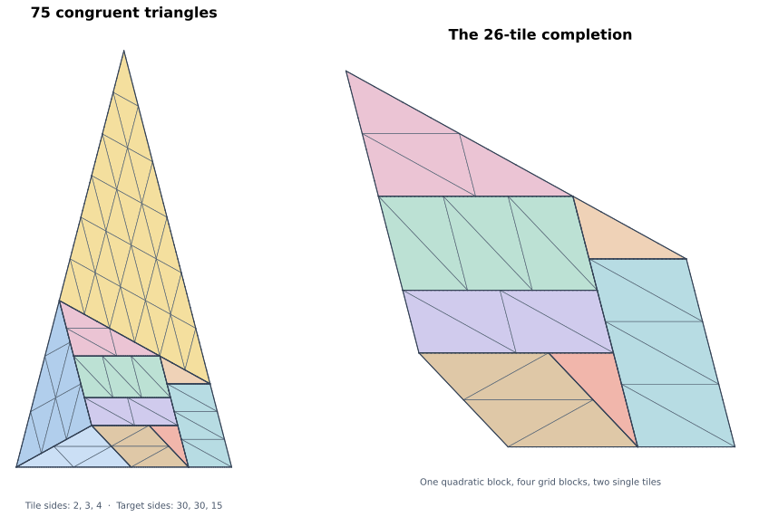

# A 75-tile construction and the complete first theta-isosceles spectrum

29 September 2026. Denis Paliy. Developed in this research project with ChatGPT
assistance. Exact internal checks are supplied; no external review or priority
claim is made.

For the tile with sides **(2,3,4)**, a triangle with equal sides **30,30** and base
**15** can be tiled by **75** congruent copies. The construction below consists
of ten elementary pieces. It requires neither a numerical optimizer nor a search
to reproduce.

This closes the last unresolved case in our fixed-tile theta-isosceles analysis:

> For the tile (2,3,4), a triangle with apex angle alpha and base angles
> theta=alpha+beta admits a tiling exactly when its tile count is
> **N=3t² with integer t>=4**.

This is a classification of one fixed tile and target shape, not all of Erdős
problem 634. The integer 75 was already globally admissible through classical
constructions; the result here specifies the different tile and target shape.

## 1. Coordinates and the ten pieces

An integer pair `(x,y)` below denotes the physical point

    (x/8, y sqrt(15)/8).

Thus squared distances are `(dx²+15dy²)/64`. Use the following points:

| Point | Integer coordinates | Point | Integer coordinates |
|---|---|---|---|
| A | (0,0) | B | (60,60) |
| C | (120,0) | P | (64,0) |
| G | (42,6) | K | (24,24) |
| L | (108,12) | U | (32,16) |
| V | (80,16) | W | (38,10) |
| Z | (86,10) | R | (90,6) |
| S | (96,0) | H | (74,6) |
| J | (84,12) | | |

The target is ABC, with `AB=BC=30` and `AC=15`. The cosine of its apex angle
is 7/8, the same as the angle opposite side 2 in the tile, so this is the required
theta-isosceles shape. Its pieces are:

| Piece | Construction | Tiles |
|---|---|---:|
| APG | A 2-fold similar copy of the tile, quadratically subdivided | 4 |
| AGK | A 3-fold similar copy, quadratically subdivided | 9 |
| BKL | A 6-fold similar copy, quadratically subdivided | 36 |
| KUV | A 2-fold similar copy, quadratically subdivided | 4 |
| UWZV | Parallelogram, 3 cells of sides 2 and 3 | 6 |
| WGRZ | Parallelogram, 2 cells of sides 3 and 2 | 4 |
| GPSH | Parallelogram, 2 cells of sides 4 and 2 | 4 |
| JSCL | Parallelogram, 3 cells of sides 3 and 2 | 6 |
| HSR | One original tile | 1 |
| VJL | One original tile | 1 |
| **Total** | | **75** |

All listed polygon orders are counterclockwise. For a direct specification of the
four parallelogram grids, use the following integer-coordinate steps:

| Origin | Step e | Step f | Cells m by n | Diagonal |
|---|---|---|---|---|
| U | (16,0) | (6,-6) | 3 by 1 | e+f |
| W | (24,0) | (4,-4) | 2 by 1 | e+f |
| G | (32,0) | (11,-3) | 1 by 2 | e-f |
| J | (24,0) | (4,-4) | 1 by 3 | e+f |

Here a cell has corners `z,z+e,z+f,z+e+f`. The chosen diagonal gives two
triangles with squared side lengths 4,9,16. For example, the first grid has
`|e|=2`, `|f|=3`, `|e+f|=4`; the third has `|e|=4`, `|f|=2`, `|e-f|=3`.
Thus every cell is tiled by two congruent (2,3,4) triangles.

The four triangular pieces have sides respectively `(4,6,8)`, `(6,9,12)`,
`(12,18,24)`, and `(4,6,8)`. Ordinary quadratic subdivision produces their
stated tile counts.

## 2. Why the pieces fit exactly

The coordinate table gives a finite elementary dissection. Some internal seams
have T-junctions; no edge-to-edge assumption is made.

For completeness, its main seam incidences are:

* K,U,W,G are collinear in that order.
* K,V,L are collinear in that order.
* V,J,Z,R,S are collinear in that order.
* G,H,R are collinear in that order.
* A,P,S,C are collinear in that order.
* A,K,B are collinear, and B,L,C are collinear.

Canceling the oriented internal edges of the ten polygons leaves exactly the
counterclockwise boundary A,C,B,A. All ten pieces lie inside ABC. Equivalently,
the sum of their boundary winding numbers equals the winding number of ABC;
because each piece has nonnegative interior multiplicity, this proves that their
interiors are disjoint and their union is ABC.

Their doubled coordinate areas are 96 times their tile counts, and the doubled
coordinate area of ABC is 7200=75·96. Each small tile has physical area
`3sqrt(15)/4`, so the total physical area is `225sqrt(15)/4`, as required.

The implementation reconstructs the ten pieces and writes every small triangle
with exact integer coordinates. Its verification checks congruence, containment,
total area, and pairwise nonoverlap. A separate checker uses exact rational
polygon clipping and edge cancellation at T-junctions.

## 3. The complete fixed-tile spectrum

Let a theta-isosceles target have equal side X. Area gives `X²=12N`. Its base is
`X/2`; both lengths are integers because they are sums of tile edges. Therefore
`X=6t` and `N=3t²` for a positive integer t. The boundary argument in
[the theta-branch proof](theta-branch.md) excludes t=1,2,3:

* t=1 has base 3, too short to contain the mandatory two c=4 edges.
* t=2 has equal side 12. The apex forces one side to contain b=3 edges, hence at
  least two of them by parity; two further c=4 edges require length 14.
* t=3 has base 9. After two c=4 edges the remaining length 1 cannot be partitioned
  into edges 2,3,4.

We now have tilings for t=4,5,6,7, with counts 48,75,108,147 respectively.
The t=4 and t=6 seeds reproduce Beeson's constructions; t=5 is given above, and
our t=7 construction is in [the theta-branch proof](theta-branch.md).

To increase any realized scale t by 4, place the unit target at `conv(0,p,q)`
with `|p|=|q|=6` and included angle alpha. The scale-(t+4) target partitions
into translated scale-t and scale-4 targets plus the parallelogram spanned by
`tp` and `4q`. Its side lengths 6t and 24 are respectively multiples of b=3 and c=4.
An ordinary b-by-c grid therefore fills the bridge. Consequently `t` tileable
implies `t+4` tileable. Starting from 4,5,6,7 yields every t>=4.

This proves the stated if-and-only-if result.

## 4. A smaller counterexample to Beeson v4 Lemma 55

In [arXiv:1206.2229v4](https://arxiv.org/abs/1206.2229v4), Lemma 55 claims that,
for this target shape, squarefree b relatively prime to c-a forces
`gcd(a,c)|M` and integral `mu=X/c`.

Here `(a,b,c)=(2,3,4)`, `b=3` is squarefree, and `gcd(3,4-2)=1`, but the
75-tile target has

    X=30, mu=30/4=15/2, M=5.

Indeed `N=3M²` in this particular shape. Thus the construction is a direct
counterexample to the printed statement. Its proof invokes the former
`gcd(a,c)|M` condition for beta-isosceles tilings, explicitly retracted in
Theorem 18 footnote 3 of the same version.

This corrects a specific lemma; it does not invalidate the existence
constructions used elsewhere in our work.
