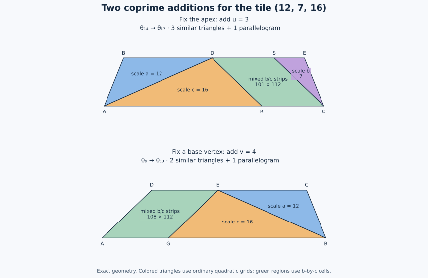

# Two annuli settle all five rational families at sufficiently large scales

29 September 2026. Research note by Denis Paliy, who directed the investigation;
ChatGPT assisted with construction, drafting, and exact checks.
The arguments have received internal checks; external review and priority
have not been established. This does not solve Erdős problem 634 in full.

**The improvement.** Every primitive rational tile in the
$3\alpha+2\beta=\pi$ group admits every sufficiently large arithmetically
possible scale in each of its five non-similar target shapes. The condition
$\Delta>0$ from the [earlier eventual-family theorem](eventual-rational-families.md)
is no longer needed. For W and beta-isosceles targets the bound below is
explicit and uses only Beeson's scale-$v$ construction.

The proof uses two small annular dissections. One adds $u$ to the theta
scale, and the other adds $v$. These increments are coprime.

## 1. Parameters and precise statement

Fix coprime integers $0<u<v$ and set

$$
a=uv,\qquad b=v^2-u^2,\qquad c=v^2,\qquad
Q=b+c,\qquad P=b+2c.
$$

The original tile has side lengths $(a,b,c)$ opposite
$(\alpha,\beta,\gamma)$, where $3\alpha+2\beta=\pi$.
Write $\theta=\alpha+\beta=\pi-\gamma$.
In particular,

$$
\cos\alpha=\frac{b+c}{2c},\qquad
\cos\theta=\frac{u}{2v},\qquad \gcd(b,c)=1.
$$

Let $\Theta_T$ denote the theta-isosceles triangle with equal sides
$bvT$ and base $ubT$. Define

$$
F_0=(b-1)(c-1),\qquad
H_u=\left\lceil\frac{a^2+b^2+F_0}{ub}\right\rceil,\qquad
H_v=\left\lceil\frac{a^2+F_0}{bv}\right\rceil.
$$

**Theorem.** The following count forms are both necessary and sufficient
at all sufficiently large integer scales, for each fixed tile:

| Target | Necessary count form | Sufficient scales supplied here |
|---|---|---|
| W, angles $(2\alpha,\beta,\theta)$ | $QT^2$ | Every $T\ge C_{W,\beta}$ |
| Beta-isosceles | $PT^2$ | Every $T\ge C_{W,\beta}$ |
| Theta-isosceles | $bT^2$ | Every $T\ge C_\theta$ |
| Alpha-isosceles | $bQK^2$ | Every $K\ge\lceil C_\theta/v\rceil$ |
| Other scalene, angles $(2\alpha,\alpha,2\beta)$ | $QPK^2$ | Every $K\ge1$ |

The explicit W/beta bound is

$$
T_0=v\left\lceil\frac{H_u}{v}\right\rceil,\qquad
\boxed{C_{W,\beta}=T_0+(u-1)(v-1)}.
$$

For theta, take any actual theta seed scale $s$.
Beeson's version 4, Corollary 5, proves that such a seed exists for every
rational tile. Then one valid bound is

$$
S=s\left\lceil\frac{\max(H_u,H_v)}s\right\rceil,\qquad
\boxed{C_\theta=S+(u-1)(v-1)}.
$$

The [explicit seed appendix](explicit-theta-seeds.md) supplies such an $s$
directly from $(u,v)$ in both parameter ranges. Thus all five bounds can
be computed from the tile. The W/beta bound does not require a theta seed.

Necessity is established in the
[scale-spectrum note](scale-spectra.md) and the
[two-character arithmetic theorem](eventual-rational-families.md).
The other-scalene row is the
[complete two-piece construction](two-piece-construction.md).
The new work here concerns sufficiency for the first four rows.

## 2. A mixed-strip observation

A parallelogram with side lengths $bc$ and an integer $L\ge F_0$, and
acute angle $\alpha$, can be tiled by the original tile.

Indeed the Frobenius theorem gives

$$
L=xb+yc,\qquad x,y\in\mathbb Z_{\ge0}.
$$

Split the $L$ direction into $x$ strips of width $b$ and $y$ strips of
width $c$. In a $b$-strip divide the other side into $c$-steps; in a
$c$-strip use $b$-steps. Each cell has side lengths $b,c$ and angle
$\alpha$, so its difference diagonal has length $a$ and splits it into
two original tiles. The number of tiles is $2L$.

All interfaces are straight boundaries of actual pieces. Their internal
subdivisions need not match: T-junctions are permitted.

## 3. An apex-centered theta annulus adds u

Suppose $T\ge H_u$. Place $\Theta_T$ and $\Theta_{T+u}$ homothetically
with their apex fixed. Their difference is an isosceles trapezoid with
bases $ubT$ and $ub(T+u)$ and legs $bvu=ab$.

Use coordinates $(x,y)$ to represent the physical point
$(x,y\sqrt{D_0})$, where $D_0=4v^2-u^2$. Put

$$
A=(0,0),\quad C=(ub(T+u),0),\quad
B=(u^2b/2,ub/2),\quad E=B+(ubT,0).
$$

Thus the trapezoid is $ACEB$. Define

$$
D=B+(a^2,0),\qquad R=(c^2,0),\qquad S=E-(b^2,0).
$$

It consists of just four pieces:

| Region | Type |
|---|---|
| $ABD$ | Original-tile triangle at integer scale $a$ |
| $ADR$ | Original-tile triangle at integer scale $c$ |
| $SEC$ | Original-tile triangle at integer scale $b$ |
| $RDSC$ | Parallelogram with sides $bc$ and $L=ubT-a^2-b^2$ |

Here the first three claims follow by the three side lengths, or directly
from the tile angles. For the last claim,

$$
D-R=S-C=\left(-\frac{b(b+c)}2,\frac{ub}2\right).
$$

This vector has length $bc$, because

$$
(b+c)^2+u^2(4v^2-u^2)=4c^2.
$$

Its reversal makes angle $\alpha$ with the positive horizontal. Also

$$
C_x-R_x=ub(T+u)-c^2=ubT-a^2-b^2=L,
$$

using $c^2-a^2-b^2=bu^2$.
Since $L\ge F_0\ge0$, the points $B,D,S,E$ occur in that order on the
top side, and $A,R,C$ occur in that order on the bottom side.
The diagonals shown therefore partition the trapezoid with disjoint
interiors.

The three triangular scales are integers. Section 2 tiles the
parallelogram. The tile count is

$$
a^2+b^2+c^2+2L
=b\big((T+u)^2-T^2\big).
$$

Consequently,

$$
T\ge H_u,\quad \Theta_T\text{ tiled}
\quad\Longrightarrow\quad \Theta_{T+u}\text{ tiled}.
$$

The annulus itself does not need a tiling of its inner triangle.

## 4. A base-centered theta annulus adds v

This time place the two theta triangles homothetically about one of
their base vertices, at the origin. Set

$$
\begin{aligned}
A&=(ub(T+v)/2,\ b(T+v)/2),&
B&=(ub(T+v),0),\\
C&=(ubT,0),&
D&=(ubT/2,\ bT/2).
\end{aligned}
$$

The trapezoid $ABCD$ is their difference. Define

$$
E=(ubT-u^3v/2,\ u^2v/2),\qquad
G=E+(ubv/2,\ bv/2).
$$

This annulus has only three pieces:

| Region | Type |
|---|---|
| $BCE$ | Original-tile triangle at integer scale $a$ |
| $BEG$ | Original-tile triangle at integer scale $c$ |
| $ADEG$ | Parallelogram with sides $bc$ and $L'=bvT-a^2$ |

For instance,

$$
BC=ab,\quad CE=a^2,\quad BE=ac,
$$

and

$$
BE=ac,\quad EG=bc,\quad BG=c^2.
$$

Furthermore, $AD=GE$ and $DE=AG$ as vectors.
The angle between $AD$ and $AG$ is $\pi-2\theta=\alpha$.
If $T\ge H_v$, then $L'\ge F_0$, which in particular places $E$ on $CD$
and $G$ on $AB$. The regions therefore form an actual disjoint
partition of the annulus.

Section 2 tiles the parallelogram. The count is

$$
a^2+c^2+2L'=b\big((T+v)^2-T^2\big),
$$

using $c^2-a^2=bc$. Hence

$$
T\ge H_v,\quad \Theta_T\text{ tiled}
\quad\Longrightarrow\quad \Theta_{T+v}\text{ tiled}.
$$

Both annular constructions add tiles outside the existing target. Neither
cuts backward through an arbitrary tiling.

## 5. Theta and alpha: two coprime additions

Beeson's Corollary 5 supplies some theta tiling for every rational tile:
his construction covers one parameter range, and Laczkovich's
complementary construction covers the other.
The arithmetic theorem makes its scale $s$ a positive integer.

Quadratic subdivision gives a seed at the scale
$S=s\lceil\max(H_u,H_v)/s\rceil$.
Starting there, both annular additions remain available.
Thus every scale

$$
S+i u+j v,\qquad i,j\in\mathbb Z_{\ge0},
$$

is tiled. Since $\gcd(u,v)=1$, Frobenius supplies every integer offset
at least $(u-1)(v-1)$. This proves the theta bound in Section 1.

The previously verified geometric transfer attaches a $bK$-fold
original-tile triangle to $\Theta_{vK}$, producing the alpha-isosceles
target with count $bQK^2$. This proves its eventual existence as well.

## 6. W and beta: explicit bounds without a theta seed

As geometric triangles, $W_T$ splits at its angle-$2\alpha$ vertex into
$\Theta_T$ and a $vT$-fold original-tile triangle.
The beta-isosceles target adds a second such triangle at the same vertex.
All these component triangles have their angle $\alpha$ there; see the
[exact family transfers](eventual-rational-families.md).

Apply homothety about this common vertex. The W annulus from scale $T$
to $T+u$ is the disjoint union of the apex-centered theta annulus and
one original-tile annulus. The beta annulus uses two original-tile annuli.

The latter are tiled by ordinary triangular grids: the scales $vT$ and
$v(T+u)$ are integers, and the smaller grid is a subcomplex of the
larger grid. Therefore an arbitrary existing W or beta tiling at scale
$T\ge H_u$ extends to scale $T+u$.

This argument does not assume that the existing tiling itself contains
the geometric theta component. The annular partition is entirely
outside that tiling.

Beeson's triquadratic construction supplies the scale-$v$ W seed; its
beta transfer supplies the beta seed. The
[pure-grid bridge](scale-spectra.md) adds $v$ to any realizable scale.
Starting at $T_0=v\lceil H_u/v\rceil$ therefore supplies all scales
$T_0+iu+jv$, and hence all scales at least

$$
C_{W,\beta}=T_0+(u-1)(v-1).
$$

In particular, both eventual-gcd divisors from the scale-spectrum note
are now **1 for every primitive rational tile**.

Some bounds, which need not be optimal:

| Tile | $H_u$ | $H_v$ | $C_{W,\beta}$ |
|---|---:|---:|---:|
| $(2,3,4)$ | 7 | 2 | 8 |
| $(6,5,9)$ | 10 | 5 | 14 |
| $(12,7,16)$ | 14 | 9 | 22 |

The first fixed tile already has the sharper exact W/beta spectra
$T\ge2$, due to Bonfioli. The purpose of the displayed bound is uniform
coverage, including the complementary $\Delta<0$ range.

## 7. A consequence across tile shapes

For every fixed odd integer $d\ge3$, all sufficiently large counts $dT^2$
are realizable by congruent triangular tiles. Indeed, choose

$$
u=(d-1)/2,\qquad v=(d+1)/2.
$$

These are coprime and give $b=v^2-u^2=d$, so the theta theorem applies.
For every fixed even integer $d\ge2$, choose instead $u=d-1$, $v=d+1$.
They are coprime and give $b=4d$, realizing every sufficiently large
$d(2T)^2$. This does not decide the small multipliers or the odd multipliers
in the even square classes.

## 8. Verification, attribution, and remaining work

The standard-library checker
[check_universal_annuli.py](../scripts/check_universal_annuli.py)
checks both constructions for all **773** coprime pairs $0<u<v\le50$.
It verifies exact side congruence of the triangular blocks, containment,
shell nesting, area, all **6957** macroregion pair separations, the
primitive parallelogram cells, integer strip decompositions, and the
tile-count identities.

The frozen [report](../verification/universal-annuli.json) passes.
These are checks of macroregions and grid formulas, **not** enumeration
of every individual tile in the large constructions.
The symbolic argument above supplies the universal result. A separate
[internal audit](audits/universal-rational-scales.md) derives both dissections
and checks the seed dependencies and W/beta lift. It is not external review.

The elementary trapezoid dissections are closely related to
Laczkovich's Lemma 2.2(ii)–(iii), *Tilings of triangles*, Discrete
Mathematics 140 (1995), 79–94.
The deductions here choose two coprime shell steps, ensure congruent
tile scales through mixed strips, and lift the shell to the W/beta
families. Beeson, *Triangle tiling: the case $3\alpha+2\beta=\pi$*,
version 4, Corollary 5, supplies the cited theta existence theorem;
the [seed appendix](explicit-theta-seeds.md) makes a seed scale explicit
using the two complementary geometries. No claim of priority or external
validation is made.

For each fixed rational tile, the first four families now have only
finitely many possible exceptional scales. Determining those
exceptions, controlling the infinitely many primitive tiles, and
settling the other groups in Erdős 634 remain separate problems.
The all-primes candidate remains subject to its own proof review.
