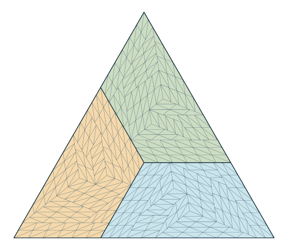

# Equilateral tilings by (3,5,7) with 540, 735, and 960 tiles

Denis Paliy, research with ChatGPT assistance. 8 October 2026.

## Result and scope

**Theorem.** For every integer `m>=6`, an equilateral triangle of side
`15m` can be tiled by `15m²` congruent `(3,5,7)` triangles.

In particular the sides 90,105,120 admit tilings with respectively
540,735,960 tiles. Complete rational coordinates for all unit triangles
are in `equilateral_540.json`, `equilateral_735.json`, and
`equilateral_960.json`.



These give positive counterexamples to the specific nonexistence
conjectures for equilateral sides 105 and 120 in Zhang,
[*Tiling Triangles with 2pi/3 Angles*, arXiv:2512.22696v4,
Section 3.1](https://arxiv.org/pdf/2512.22696).
The numbers 105 and 120 there are side lengths; the corresponding counts
are 735 and 960. No priority claim beyond the inspected sources is made.

The same paragraph of Zhang states that `X<105` was excluded by Beeson.
The 540-tile construction here has X=90, so that literal side-length
statement cannot hold. The inspected Beeson text,
[*Tiling an Equilateral Triangle*, 1812.07014v3,
Section 3.1](https://arxiv.org/html/1812.07014v3), instead discusses
computational exclusion of **tile counts N<105**. A confusion of the two
variables is a plausible explanation; the geometric certificates do not
depend on diagnosing that textual issue.

This does not prove that 540 is minimal. It does not classify every
admissible tile count in Erdős 634. The construction at every `m>=9`
was already supplied by Zhang; the new positive multipliers here are
6,7,8.

## The finite geometric seed

In Eisenstein coordinates `(u,v)` means
`(u+v/2,sqrt(3)v/2)`. Define

```
T(x,L) = [(0,0),(x+L,0),(x,L),(0,L)].
```

The new seed tiles `T(30,30)` with exactly 180 congruent `(3,5,7)`
triangles. Its full coordinate certificate is
[`T30_30_0-1_certificate.json`](../equilateral-position/cpsat/T30_30_0-1_certificate.json).
Coordinates in that file are integer pairs divided by 7.

The finite certificate is the input to this construction theorem, not
the solver's status message. Its exact checks establish:

* every triangle has squared side lengths `9,25,49`;
* every triangle is contained in the indicated convex trapezoid;
* all 16,110 pairs of distinct triangles have disjoint interiors;
* the total area equals the area of the trapezoid.

These statements imply complete coverage: a positive-area gap in the
interior would contradict area equality, and the closed union then also
covers the boundary. Separate geometric implementations verified the
seed. No floating point tolerance enters its geometric acceptance.

## Elementary auxiliary trapezoids

The classical basic ideal trapezoid `T(34,15)` is a union of three
triangles similar to `(3,5,7)` at integer scales 5,7,3, hence with
25+49+9=83 unit triangles. Its vertices are

```
A=(0,0), B=(49,0), C=(34,15), D=(0,15), E=(25,15),
```

and the three triangles are `AED, ABE, EBC`. This is Zhang's basic
ideal-trapezoid construction, also used in the preceding project work.

If `x-34=3p+5q` with nonnegative integers p,q, attach a parallelogram
of horizontal width `x-34` and leg 15 on its right. Partition the
parallelogram into width-3/height-5 or width-5/height-3 cells in the
60-degree lattice. Each cell splits into two original triangles. Thus
`T(x,15)` is tiled.

In particular every `x=15k`, `k>=3`, works, since

```
15k-34 = 3(2+5(k-3)) + 5.
```

Stacking bands of leg 15 consequently tiles `T(x,15n)` whenever
`x=15k`, `k>=3`, `n>=1`. The successive short bases from top to bottom
are `x,x+15,...,x+15(n-1)`.

The new seed extends this to

```
T(30,15n) for every n>=2.
```

For n=2 use the seed. For n>2 place the seed at height `15(n-2)` and
fill the lower portion by the known `T(60,15(n-2))`. The shared segment
has length 60, so this is an actual partition with no subtraction of
an unsupported tiling.

## Cyclic assembly and the infinite family

Write `R(u,v)=(-u-v,u)` for rotation by 120 degrees. For positive
r,s,t, put `S=15(r+s+t)`. These three trapezoids partition the
equilateral triangle `[(0,0),(S,0),(0,S)]`:

```
(15s,0)          + T(15r,15t),
(0,15(s+t))     + R² T(15t,15s),
(15(s+r),15t)   + R  T(15s,15r).
```

This is the cyclic three-trapezoid assembly of Zhang, written with
explicit coordinates. The three interiors are disjoint and their
boundary edges cancel pairwise. The count, computed by areas, is
`15(r+s+t)²`.

For any m>=6 choose `(r,s,t)=(2,2,m-4)`. The required pieces are

```
T(30,15(m-4)), T(15(m-4),30), T(30,30).
```

The first is supplied by the new seed extension. The last is the seed.
The middle is the seed when m=6, and is one of the elementary auxiliary
trapezoids when m>=7. Hence all three pieces are tiled and the theorem
follows.

For side 90 the construction uses just three rotated copies of the
180-tile seed. The saved 735-tile certificate uses parameters (2,2,3).
The saved 960-tile certificate uses the equivalent convenient choice
(2,3,3).

## Reproduction and independent checking

Run `python construct_new.py` in this directory to regenerate all
three full unit-coordinate certificates and the intermediate
`T30_45_315.json`. The generator imports neither the search program nor
a solver verdict. It reads only the 180 unit coordinates and constructs
all other tiles with the explicit grids above.

The independently written checker in
[`../equilateral-audit/`](../equilateral-audit/) verifies all unit
side lengths, target containment, pairwise disjointness, and total area.
The pair counts are 145,530 for 540 tiles, 269,745 for 735 tiles, and
460,320 for 960 tiles. These are internal independent implementations,
not external peer review.
