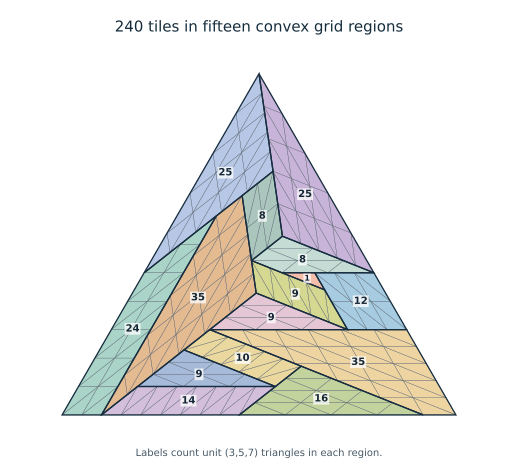

# Complete exclusions of 60 and 154; an equilateral tail beginning at 240

8 October 2026. Denis Paliy, research with ChatGPT assistance.

**This package does not solve Erdős634.** It closes two complete counts and
constructs an infinite sector. Negative conclusions combine written structural
proofs, the published classification inputs, and exact independently replayed
computational certificates. Independent internal implementations are not
external peer review, and no claim of historical priority is made.

## Main results

| Result | Complete argument and checks |
|---|---|
| **N=154 is impossible** | [Global proof](154-audit/GLOBAL_154_PROOF.md), [all-branch arithmetic](arithmetic-gates/README.md), [fresh structural audit](w-beta/154_STRUCTURAL_REVIEW.md), and three independently replayed complete five-height position certificates. No arbitrary coordinate mesh or assumed tiling pattern. |
| **N=60 is impossible** | [Proof](e60-position/PROOF.md), including all-branch reduction, the new 49-tile gap-tail obstruction, two complete four-height position enumerations and independent replay. |
| **Every N=15m² with m>=4 is realizable** | [240-tile seed and induction](equilateral240/PROOF.md), [compact 15-region geometric construction](equilateral240/MACRO_240_PROOF.md), exact 240/375 certificates and independent all-pairs geometry. |
| **Only135 remains in square class15** | [Full reduction](class15/REDUCTION.md): 15 and60 are impossible; all m>=4 are constructed.135 is unresolved. This reduction covers all tiles and triangle shapes. |

## Why the 154 exclusion is global

The published angular and rationality inputs reduce154 to tile(8,7,13)
in target(91,91,154). Whole-edge median cuts, an affine-line population lemma,
and a separately replayed six-height direction calculation imply at most five
consecutive short-edge heights, containing zero. Three bands suffice up to
reflection. Their complete lattices contain respectively
4,773,371,018, 4,770,414,013 and4,759,540,301 possible contained tile placements.

The negative certificate repeatedly uses only this rule: in a homogeneous
boundary equation with coefficients of one sign, nonnegative variables must
vanish. Eventually a nonzero outer-boundary equation has no variable of its
required sign. This excludes even nonnegative fractional solutions.

The separate checker reconstructs the geometry, all placements, every asserted
zero mask and the terminal contradiction. The three replays pass. Code and
exact trace hashes are included; deterministic traces are regenerated by the
commands in [the positional package](154-cpsat/README.md). The final proof
requires no CP-SAT solver.

## Additional completed work

* [Trapezoid propagation](global/TRAPEZOID_PROPAGATION.md): new positive families
  from the180 and240 seeds; no converse is asserted.
* [An eleven-region construction](seed-generalization/MACRO_PROOF.md) for the
  earlier180-tile trapezoid, replacing a large unit-coordinate description.
* [One-height obstruction for the reflected F3 corner](4830/ONE_LEVEL_OBSTRUCTION.md),
  including the792-tile remainder relevant to4830. This does not exclude4830.
* [Complete signed inventories for the surviving five-height154 bands](154-inventory/README.md)
  and [formal60 inventories](e60-inventory/README.md). These show why directional
  totals alone do not supply the positional nonexistence proof.

* [Necessary135 geometry](e135-structure/NO_GAPS.md): no gaps in occupied
  heights, by an independently checked exact cell bound. The
  [parity-current argument](e135-inventory/README.md) bounds the number of
  occupied heights by nine. This does not decide135.
* [An actual2160-tile counterexample](e135-construction/EXTREME_POPULATION_COUNTEREXAMPLE.md)
  has just14 tiles at its extreme short height. Its full geometry passes
  all2,331,720 pair checks. Thus a proposed universal larger population
  floor cannot legitimately be used to finish the remaining case.

## Incomplete and diagnostic work

The [135 search](e135-search/README.md) gives two complete three-height
CP-SAT models with INFEASIBLE verdicts, but these have no independent UNSAT
replay and do not cover larger supports. Further [bitmap and CP-SAT probes](e135-bitmap/README.md)
retain this diagnostic scope: even a complete seven-height placement pool
leaves a nonempty positional relaxation.135 remains unresolved.
The4830 finite macro pools and previous time-limited searches likewise do not
settle their unrestricted geometric questions. The W/beta assessment retains
the prime-case manuscript's candidate status.

The full problem still lacks necessary-and-sufficient small-scale conditions
in several branches. Counts135 and4830 remain unresolved in this work. A finite
verification method or more effective complete search does not by itself give
the missing structural classification of all N.
