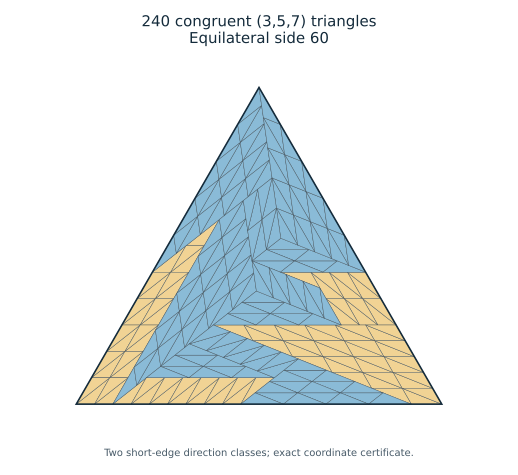
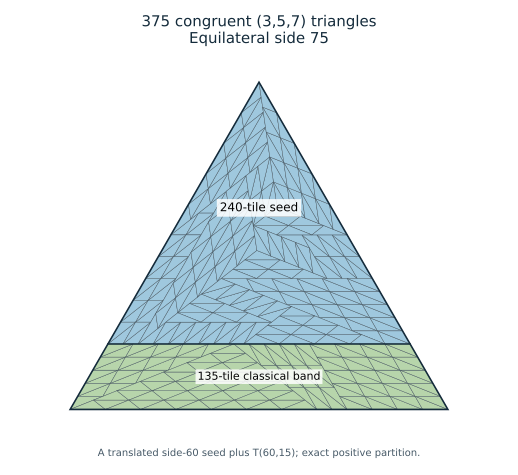

# Every equilateral multiplier m >= 4 for the tile (3,5,7)

Denis Paliy, research with ChatGPT assistance. 8 October 2026.

## Result

**Theorem.** For every integer `m>=4`, the equilateral triangle of side
`15m` can be tiled by `15m²` congruent triangles with sides `(3,5,7)`.

In particular, there are exact tilings with **240** and **375** tiles,
with equilateral sides **60** and **75**. This improves the previously
constructed tail `m>=6`. No minimality claim for 240 is made here.
The general classification in Erdős 634 does not follow from this
fixed-tile theorem.



## The new finite seed

Use Eisenstein coordinates `(u,v) = u+v exp(i pi/3)`.
The exact positive certificate
[`equilateral_240.json`](equilateral_240.json) contains 240 triangles,
with all coordinate numerators integral and common denominator 7.
The target has vertices `(0,0),(60,0),(0,60)`.

The seed was found by a finite position-sensitive search. The proof of
its validity is the supplied coordinate certificate together with exact
geometric verification: every triangle has squared side lengths 9,25,49,
every triangle is contained in the target, distinct triangles have
disjoint interiors, and the total area equals the target's area.
Containment, disjoint interiors and area equality imply coverage; the
finite union is closed, so it also contains the target boundary.

An independently written geometric checker verified all 28,680 tile
pairs, in addition to the lengths, containment and areas. Its report is
[`../global/E60_independent_geometry.json`](../global/E60_independent_geometry.json).
This independent implementation is an internal check, not external peer
review. The generator below does not import the search program or rely
on its status message.

## A compact geometric description of the seed

The 240 tiles have also been regrouped into **15 convex ordinary-grid
polygons**, all triangles or quadrilaterals. Their full small coordinate
table and elementary grid proof are given in
[MACRO_240_PROOF.md](MACRO_240_PROOF.md). The standalone `macro_240.py`
reads only these macroregions and reconstructs exactly the same 240 unit
triangles, without reading the original unit certificate or importing a
searcher. It checks all 105 pairs of macroregions with exact arithmetic.


## A classical band extends side 15m to side 15(m+1)

Let

```
T(x,L) = [(0,0),(x+L,0),(x,L),(0,L)].
```

The classical basic trapezoid `T(34,15)` is tiled by `(3,5,7)`.
Explicitly, set

```
A=(0,0), B=(49,0), C=(34,15), D=(0,15), E=(25,15).
```

The three triangles `AED`, `ABE`, `EBC` are similar to the original tile
at integer scales 5,7,3, and therefore have ordinary quadratic grids
with 25,49,9 unit tiles. This is the established Zhang basic-trapezoid
construction, reproduced in the preceding
[construction note](../../closure-position-oct8/equilateral-small/CONSTRUCTIONS.md).

If `x-34=3p+5q`, with p,q nonnegative integers, attach the parallelogram
of horizontal width `x-34` and sloping leg 15 to the right of this
trapezoid. Each width-3 strip is divided into three length-5 cells;
each width-5 strip into five length-3 cells. Their 60/120-degree
parallelograms split into two original tiles. This constructs `T(x,15)`
with `2x+15` tiles.

For every integer `m>=4`, the required shorter base `x=15m` satisfies

```
15m-34 = 3(5m-13) + 5,
```

with nonnegative coefficients. Thus `T(15m,15)` is tiled and has
`30m+15` unit triangles.

Now translate a side-15m equilateral tiling by `(0,15)` and adjoin this
trapezoid in its canonical position. The shared edge runs from
`(0,15)` to `(15m,15)`. Their union is exactly the equilateral triangle

```
[(0,0),(15(m+1),0),(0,15(m+1))].
```

The interiors are disjoint, and the resulting number of unit tiles is

```
15m² + (30m+15) = 15(m+1)².
```

Starting with the new 240-tile seed at m=4 proves the theorem by
induction. This positive band attachment does not require a tiling at
multiplier one and does not assume that every equilateral tiling admits
such a partition.

## The 375-tile construction

At m=4 the added piece is `T(60,15)`, which contains 135 tiles.
Therefore the translated 240-tile seed together with this band gives
375 tiles at side 75:



The full unit certificate is
[`equilateral_375.json`](equilateral_375.json). The independent checker
verified its 1,125 edge lengths and all 70,125 tile pairs, as well as
containment and total area; see
[`../global/E75_independent_geometry.json`](../global/E75_independent_geometry.json).

The union of one triangular seed and a trapezoid is a different
construction from a cyclic partition into three ideal trapezoids.
The necessary leg-divisibility obstruction for that latter construction
at side 75 does not apply to the present partition.

## Reproduction

From this directory run

```
python construct_tail.py
```

to regenerate the complete 240- and 375-tile certificates. To expand any
other specified multiplier use `python construct_tail.py --m 6`, for
example. The program reads the exact 240 seed and imports only the
preceding elementary grid and band routines. No optimization is needed
to reproduce the construction.

Run the independent checker from the repository root:

```
python research/closure-position-oct8/equilateral-audit/independent_geometry.py research/final-closure-oct8/equilateral240/equilateral_375.json
```

`draw_figures.py` renders the certificates to vector SVG figures; floating
point is used for drawing only, not geometric acceptance.
