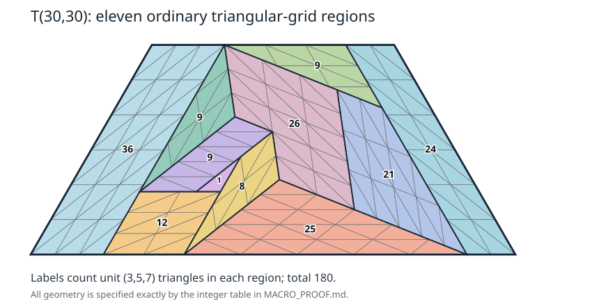

# An eleven-region proof of the 180-tile trapezoid seed

Denis Paliy, research with ChatGPT assistance. 8 October 2026.

This note compresses the preceding computer-discovered construction into an
ordinary polygonal dissection. It proves again that `T(30,30)` is tiled by
180 congruent `(3,5,7)` triangles. It does **not** assert that its particular
pattern extends to every primitive 120-degree tile.



## The grid lemma

Coordinates `(x,y)` mean `x+y rho`, where `rho=exp(i pi/3)`.
For vectors u,v with lengths 3,5 and with `|u-v|=7`, draw the lattice
`o+Z u+Z v`, subdividing each elementary parallelogram along the diagonal
joining `o+(i+1)u+jv` to `o+i u+(j+1)v`.
Every elementary triangle has sides 3,5,7.

A simple polygon whose vertices have integer coordinates in this lattice
and whose edges follow the lines `i=integer`, `j=integer`, or
`i+j=integer` is a union of these elementary triangles. Indeed, these
three families are precisely the edges of the triangular subdivision;
no elementary triangle interior is crossed by the polygon's boundary.
This argument also applies to a nonconvex polygon.

## Eleven explicit grid polygons

**All coordinates and vectors in the following table are divided by 7.**
Each listed polygon is counterclockwise. The target is

```
P = [(0,0),(420,0),(210,210),(0,210)] / 7 = T(30,30).
```

The fourth and fifth columns are the two unit-tile short-edge vectors,
not sides of the entire macroregion.

| Region | Count | Grid origin | u | v | Polygon vertices |
|---|---:|---|---|---|---|
| Right strip | 24 | (378,0) | (21,0) | (-35,35) | (168,210), (378,0), (420,0), (210,210) |
| Low rectangle | 12 | (98,0) | (0,21) | (-35,0) | (63,0), (133,0), (133,63), (63,63) |
| Upper triangle | 9 | (175,168) | (-21,21) | (35,0) | (63,210), (231,147), (168,210) |
| Left rectangle | 36 | (21,0) | (-21,0) | (0,35) | (0,0), (63,0), (63,210), (0,210) |
| Notch tile | 1 | (133,63) | (-21,0) | (0,35) | (112,63), (133,63), (133,98) |
| Lower triangle | 25 | (182,0) | (9,15) | (-40,15) | (133,0), (378,0), (178,75) |
| Thin trapezoid | 9 | (112,63) | (9,15) | (-40,15) | (63,63), (112,63), (148,123), (108,138) |
| Notched triangle | 8 | (148,25) | (-15,24) | (-15,-25) | (133,0), (178,75), (148,123), (133,98) |
| Left triangle | 9 | (78,88) | (-15,24) | (-15,-25) | (63,63), (108,138), (63,210) |
| Right trapezoid | 21 | (329,49) | (-24,9) | (25,-40) | (183,165), (258,45), (378,0), (231,147) |
| Staircase | 26 | (243,69) | (15,-24) | (-40,15) | (63,210), (108,138), (148,123), (178,75), (258,45), (183,165) |

For every row the integer-coordinate norm `Q(x,y)=x²+xy+y²` gives

```
Q(u)=441, Q(v)=1225, Q(u-v)=2401.
```

After division by 7 the lengths are therefore exactly 3,5,7.
Solving `p=o+i u+j v` at each listed vertex gives integer i,j; successive
vertex differences have `delta i=0`, `delta j=0`, or
`delta i+delta j=0`. The grid lemma tiles each row. The counts in the
second column can be obtained either by counting grid cells or by the
ordinary determinant area formula.

The polygons lie inside the convex target. Their oriented boundaries
cancel on all internal segments and sum to the counterclockwise boundary
of P. This identity is an exact identity of placed line segments, with
segments split at every endpoint when needed. It proves they form a
partition: the sum of their indicator functions minus the indicator of
P has zero jump across every segment, and is zero in the unbounded
component. It is therefore zero on every complementary open cell. Since
each polygon is simple and positively oriented, the indicators are
nonnegative; overlap is impossible. Closedness supplies the boundaries.

The total number of elementary triangles is

```
24+12+9+36+1+25+9+8+9+21+26 = 180.
```

Thus this is a constructive proof requiring eleven small integer grid
polygons, rather than a list of 180 unrelated placements.

## Reproduction

Run `python macro_seed.py`. The program imports neither a search solver
nor the preceding 180-triangle certificate. It verifies the grid norms,
lattice coordinates and edge directions, simplicity and orientation of
each polygon, containment, counts, and exact boundary cancellation. It
then expands the eleven ordinary grids into `macro_seed_certificate.json`.
The intermediate grid polygons and exact check status are recorded in
`macro_seed_verified.json`.

This is a second description of the existing positive seed, not an
additional newly realizable tile count. The three same-short-direction
components in the earlier certificate have 49,33,98 tiles, but are
nonconvex; in particular the number 98=2c² does not make the third
component a c-by-c parallelogram.

## Consequences for ideal trapezoids

Write `S=<3,5>={0,3,5,6} union {x integer:x>=8}`. The preceding
[universal shaving construction](../../group2-trapezoids/PROOF.md)
provides `T(x,15n)` at every n>=1 when

```
x in {29,31,32} union {x integer:x>=34}.
```

Appending a pure short-grid parallelogram of width 3 and height 30 to
the new seed gives `T(33,30)`. Therefore, using that construction and
the new seed, every `T(x,30)` with integer x>=29 is tiled. For n>2,
place this height-30 piece at the top and fill the lower portion by
`T(x+30,15(n-2))`, whose short base is at least 59. Consequently:

**Corollary 1. Every `T(x,15n)` with integer x>=29 and n>=2 is tiled.**

There is also a wider, later tail. Three cyclic copies of the new seed
form the side-90 equilateral triangle, which is the degenerate ideal
trapezoid `T(0,90)` (its short base has length zero). Appending a pure
short-grid parallelogram of width x and height 90 works for every x in
S: write x=3p+5q, use width-3 strips with 18 length-5 steps, and width-5
strips with 30 length-3 steps. Thus `T(x,90)` is tiled. For n>6 stack
known bands below this piece, with shorter bases at least x+90>=90.

**Corollary 2. Every `T(x,15n)` with x in S and n>=6 is tiled.**

For positive integer x the values 1,2,4 are impossible at every height:
the top boundary must be a sum of whole tile edges of lengths 3,5,7.
At n>=6 these corollaries settle all nonnegative integer x except 7.
No nonexistence statement for x=7 is asserted here.

These fixed-tile trapezoid results do not classify all N in Erdős 634.

## A necessary guard on attempted extensions

The leg divisibility cannot be replaced by an area-integrality test.
For any primitive rational 120-degree tile, the established signed
boundary characters give `ab | L` for a tiled ideal trapezoid `T(x,L)`.
Indeed, its four counterclockwise boundary edges have character sum
`(x+L)+L-x+L=3L` for both characters. With
`X=c+a-b`, `Y=c+b-a`, `XY=3ab`, the corresponding signed tile sums
`U=3L/X`, `V=3L/Y` are integers of the same parity. Hence

```
(U+V)/2 = Lc/(ab)
```

is an integer, and pairwise coprimality of a,b,c implies `ab | L`.
This is the same proof as the equilateral divisibility in the
[general-spectra note](../../general-spectra/PROOF.md), applied to the
trapezoid's boundary; the explicit trapezoid statement also appears in
Harries, *New constructions, obstructions, and multiplier structure for
Erdos Problem 634*, 28 August 2026, the section "Construction thresholds and additive multiplier sets".

In particular `T(25,25)` is impossible for `(3,5,7)`, despite its integer
area ratio 125. It cannot supply a side-75 equilateral construction by
three cyclic copies. More generally, every leg in the standard cyclic
three-trapezoid assembly must be a multiple of 15. At equilateral side
75, the positive integer leg multipliers therefore partition 5 as
`1+1+3` or `1+2+2`. These force a one-leg trapezoid with short base 15 or
30. Harries's stated one-leg exclusion rejects both, with the explicitly
stated evidence class of one exhaustive-search implementation without an
independently replayed refutation certificate. Thus the standard cyclic
assembly has this separate documented obstruction; it is not a proof
that an arbitrary side-75 equilateral tiling is impossible.
