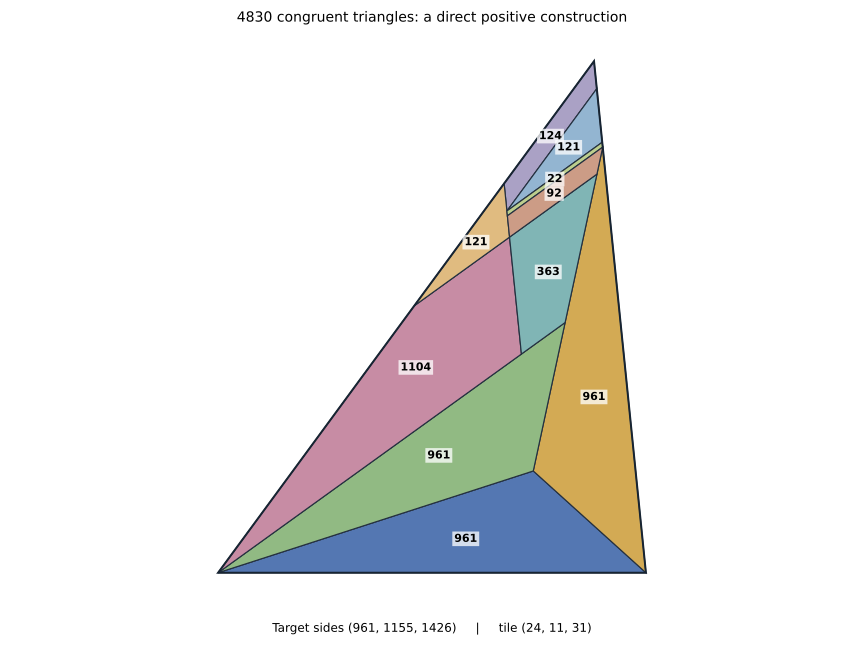

# General F3 and W constructions, and exact small-count certificates

8 October 2026. Denis Paliy, research with ChatGPT assistance.

**This package does not solve the full Erdős problem634.** It proves a new
general sufficient construction, closes4830 positively, and extends a uniform
infinite sector. Its negative searches are distinguished from fully verified
negative certificates.

## Completed positive theorems

For an integral120-degree tile, let `c²=a²+ab+b²`. If `a>2b` and

```
b²+2ab−a² = q c + A a + B b,     q>=1, A,B>=0,
```

the ordered F3 target with sides `c²,c(a+2b),3b(a+b)` can be tiled by
`3(a+b)(a+2b)` congruent `(a,b,c)` triangles. Every positive multiplier
follows by subdivision. The proof partitions the remaining corner into
five explicitly tiled positive regions; it makes no assumption about the
form of arbitrary tilings.

For `(24,11,31)`, the required identity is `73=2·31+11`. Thus
**4830 and every4830m² are realizable**. The target has sides
`(961,1155,1426)`. The generator needs no position search or solver.

* [General geometric theorem and short4830 proof](f3-general/MIXED_CORNER_THEOREM.md).
* [Independent general geometric audit](4830-position/GENERAL_CORNER_AUDIT.md).
* [Full4830 unit-coordinate certificate](f3-general/f3_4830_macro.json),
  [independent geometry check](f3-general/f3_4830_macro_verified.json), and
  [separate full-boundary check](f3-general/full_boundary_independent.json).
* [Direct generator](f3-general/construct_f3_mixed.py).



The [arithmetic theorem](global/F3_UNIFORM_CONE.md), with its
[independent audit](e135/F3_CONE_AUDIT.md), proves that the
construction condition holds for every primitive norm tile in

```
2 < a/b < 2725/1139.
```

Together with the preceding `0<a<2b` theorem this gives all positive
multipliers throughout **`0<a/b<2725/1139`**. A Frobenius estimate handles
all large tiles, and the complete finite remainder has710 directly checked
positive witnesses. The endpoint tile fails this construction criterion;
arbitrary tilings at the endpoint are not excluded.

There is also an [explicit asymptotic primitive-tile sector](global/F3_ASYMPTOTIC_SECTOR.md)
on every closed ratio interval strictly below `1+sqrt(2)`.

## Additional positive W and beta constructions

The [uniform W dissection](group1-adjacent/PROOF.md) constructs

```
N=t²(t²−2),
tile=((t−2)(t−1),2t−3,(t−1)²),             integer t>=4.
```

The target sides are
`t((t−1)³,(t−2)(t²−2),(t−1)(2t−3))`.
Four ordinary outer grids and an explicit positive remainder dissection
work for every parameter. A single unit triangle is transferred between
the central strip and its end cap; the two regions then meet exactly.
The [symbolic audit](group1/ADJACENT_UNIVERSAL_AUDIT.md) proves the complete
positioned-boundary, positivity, metric and tile-count identities for all
parameters. [Direct generation](group1/adjacent_formula.py) requires no
search. The first counts are224,575,1224,2303 and3968; no priority claim is
made for counts already covered by other constructions.

[Two fixed-family spectra](group1/PROOF.md) for tile `(6,5,9)` now have
explicit tilings at every scale `m>=3`: the W target `(27m,28m,15m)` has
`14m²` tiles, and the beta target `(27m,27m,46m)` has `23m²` tiles.
The new W224 witness supplies the formerly missing scale-four seed.
Its beta extension has368 tiles. **The integer368 was already realizable**
by Beeson's W construction using tile `(12,7,16)`; the new368 result concerns
the specified tile and shape. The scale-three seeds and the cap increment
are credited prior inputs.

Both new finite witnesses pass separate exact pairwise geometry and
[positioned-boundary](verify_w_boundary.py) checks. No complete W56 or
global square-class14 exclusion is inferred from a restricted-band search.

## Complete exclusion of 135 and classification of square class15

The [nine-level reduction](e135/REDUCTION.md) covers all potentially
relevant bands for the unique arithmetic135 candidate, tile `(3,5,7)`
in an equilateral target of side45. The five full placement pools total
**2,102,004,892,515 positions**. Every deletion step was independently
replayed. Their remaining placements, including reflections, are subsets
of one exact physical pool of 246600 triangles.

The independent [metric and model checker](e135/check_unit_metric_model.py)
reconstructed all 247770 equations and 1479600 coefficients. The complete
residual Boolean system was then refuted by a native LRAT certificate,
which a separately compiled checker verified in full, including the final
empty clause. The certificate is 1,944,819,324 bytes before compression.
The [full proof](global/GLOBAL_135_PROOF.md) joins all arithmetic,
structural, positioned-geometric and propositional verification steps.
Thus **135 is impossible**.

Combining this exclusion with the previously verified15/60 exclusions and
the constructive240 seed and induction gives, for every positive integer m,

```
15m² is realizable if and only if m>=4.
```

The earlier limited DRAT verification and incomplete optimization runs are
not premises of the completed LRAT proof.

The [Boolean encoding audit](overlap-literature/SAT_AUDIT.md),
[RLE and normalization audits](global/README.md), and exact DSU/OPB
checks are supplied. Floating-point LP timeouts and the optional
pseudo-Boolean timeout are explicitly inconclusive.

## General limits and attribution

The [atomic-current matrix is not totally unimodular](global/NON_TU.md):
a universal three-placement witness has determinant2. This excludes one
proposed integrality argument; it does not refute sufficiency of a special
triangular-boundary fractional relaxation.

[Square class15 cannot be covered by W or F3](overlap-literature/CLASS15_NO_W_F3.md),
despite its already constructed positive tail. Thus a global reduction
must retain more than those two branches and finitely many isolated counts.

The [fresh Bonfioli audit](overlap-literature/BONFIOLI_56_AUDIT.md) records
his prior60 and56 exclusion claims and their exact source versions. Our60
proof is an independent certificate-based proof, not a priority claim.
The E56 computation was reproduced; the W56 component remains separately
labelled until its local replay finishes.

Independent checks here are separate implementations and internal
mathematical reviews. They are not external refereeing or a proof-assistant
formalization of the entire mathematical dependency chain. General
small-scale conditions beyond the proved sectors, including the universal
prime-case geometric gap, remain open in this work.

The [all-integer gap audit](global/ALL_N_GAP_AUDIT.md) identifies an infinite
F3-only arithmetic family whose displayed scale-one candidates have
unbounded `a/b` and negative residuals in both general corner recipes.
At its first member, **14430**, a complete independent arithmetic gate
leaves exactly one primitive candidate: tile `(56,9,61)` in target
`(3721,4514,1755)`. This is a precise remaining geometric question, not
an impossibility theorem. No uniqueness assertion is made for every
member of the infinite family.
